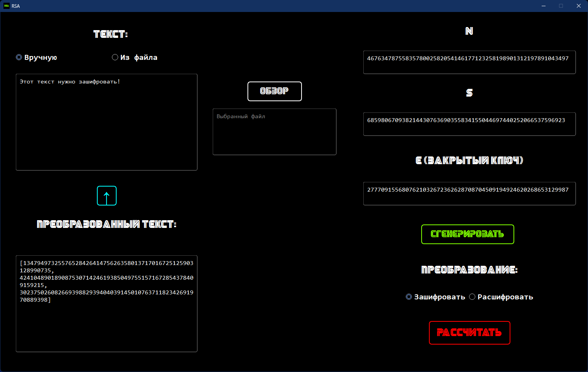

# RSA

## Описание программы

Данная программа позволяет шифровать введённый текст либо выбанный файл с помощью алгоритма RSA.

## Запуск программы

Для запуска программы установите все зависимости из `requirements.txt`. Выполните команду `python -m main` для запуска программы.

## Пример работы программы

